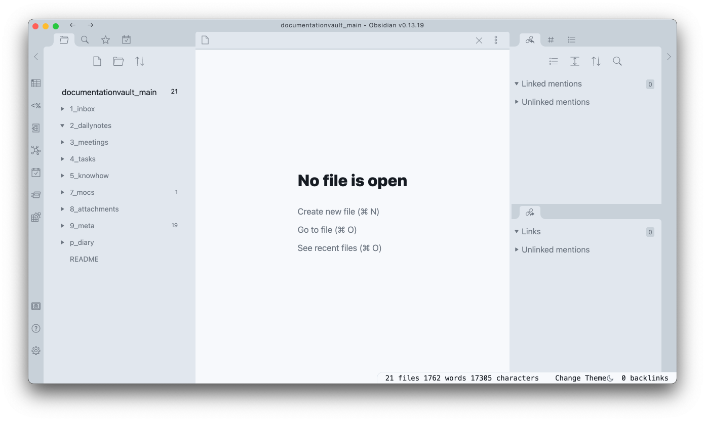
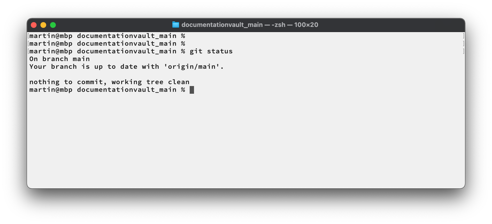

<!--
    Some meta information about this document:

    * I use the GitHub flavor of markdown.
    See [https://guides.github.com/features/mastering-markdown](https://guides.github.com/features/mastering-markdown) for how to use it.

    * I follow the one sentence per line approach which I came across several years ago when learning AsciiDoc(tor).
    See [https://asciidoctor.org/docs/asciidoc-recommended-practices/#one-sentence-per-line](https://asciidoctor.org/docs/asciidoc-recommended-practices/#one-sentence-per-line) for the reasoning behind this approach.

    * Most parts of this whole article I have written with Visual Studio Code, benefitting from its in-built Markdown support. To get the table of content created automically, I have added the extension "alanwalk.markdown-toc". So, in case you would like to change something in the structure of this article, please consider using this extension as well to keep the toc consistent with the content.
 -->

[(back to main page)](README.md)

# The Documentation Vault - How to use

<!-- TOC -->

- [Introduction](#introduction)

<!-- /TOC -->

## Introduction

This document describes **several workflows for a small group of people working together** to

- **document meetings** that have happened or are currently going on,
- **describe and schedule tasks** which need to be done by someone, and
- **find information** quickly, typically while a meeting is just going on.

In addition there are some more workflows which enable you to

- **document some knowledge** which is longer-lasting and might also be interesting for the group, and
- **keep some personal diary** to document things which are only to be visible by the group member who wrote it.

As we live in the digital world, we do need some digital tooling which enable us using these workflows:

* As the main tool I use [**Obsidian**](https://obsidian.md).
Obsidian works on a so-called "vault" which is mainly a folder containing all your content in the form of Markdown text files plus a sub-folder ".obsidian" which stores the configuration, plug-ins, and themes.

* In addition, and somehow "below Obsidian", I use **Git** to manage all the files which either you create or which I already prepared to provide my opinionated structure and setup of how we should use Obsidian.

In the [other part of this document](how-to-configure.md) you will find information about how to configure all this.
But even with best configuration, tools are just tools, and they still need to be used by us.

By the way:
These workflows and how they are configured are heavily influenced by its ancestor document ["The Documentation Mode"](https://martinleggewie.github.io/documentationmode) in which I describe the more or less same types of workflows, but use Emacs and the in-built Org mode instead of Obsidian.
So, in case you would like to know more about the roots of and the motivation for these workflows, you might consider checking this other documentation as well.

CONTINUE HERE!

[(back to main page)](README.md)

----

_Martin Leggewie, 2022-01-09_
